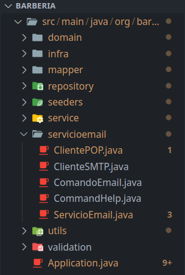
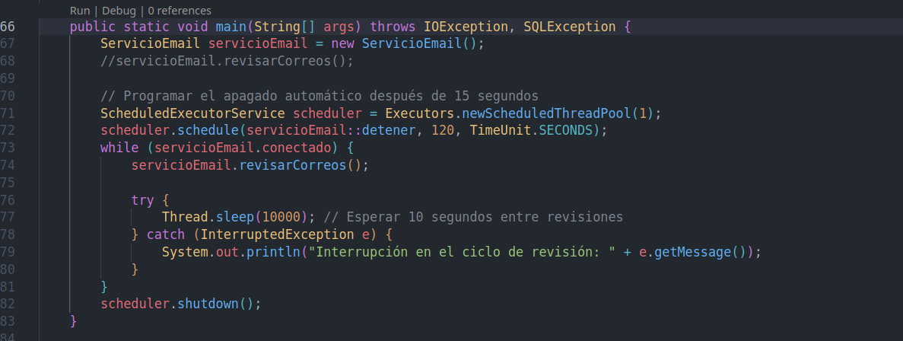

# 📧 Sistema de Barbería con Servicio de Email

Sistema de gestión de barbería con integración de comandos por correo electrónico (POP3/SMTP).

---

## 📍 Ubicación del Main de ServicioEmail

El `main` del servicio de email se encuentra en:

```
src/main/java/org/barberia/usuarios/servicioemail/ServicioEmail.java
```

**Clase:** `ServicioEmail`  
**Método:** `main(String[] args)`

### Ejecución del Servicio

Para iniciar el servicio de correo electrónico ejecute en su visual estudio code el main de servicioemail/ServicioEmail.java , aga click en run:
 en el correo enviar un mensaje a grupo11sa@tecnoweb.org.bo en el asunto van los comandos





**Comportamiento del servicio:**
- Se conecta automáticamente al servidor POP3 configurado.
- Revisa correos cada 10 segundos.
- Procesa comandos del subject de los correos.
- Responde automáticamente por SMTP.
- Se detiene automáticamente después de 120 segundos (2 minutos).

---

## 🔧 Comandos Disponibles

Los comandos se envían a través del **Subject** del correo electrónico. Cada comando sigue el formato:

```
<OPERACIÓN><ENTIDAD>[param1, param2, ...]
```

### Formatos Generales

| Operación | Formato | Descripción |
|-----------|---------|-------------|
| **LISTAR** | `LISTAR<ENTIDAD>[*]` | Listar todos los registros de una entidad |
| **CREATE** | `CREATE<ENTIDAD>[param1, param2, ...]` | Crear un nuevo registro |
| **UPDATE** | `UPDATE<ENTIDAD>[id, param1, param2, ...]` | Actualizar un registro existente |
| **DELETE** | `DELETE<ENTIDAD>[id]` | Eliminar un registro por ID |
| **GET** | `GET<ENTIDAD>[id]` | Obtener un registro específico por ID |
| **HELP** | `HELP` | Mostrar los comandos disponibles |

---

## 📋 Entidades y Comandos

### 1. **USUARIOS**

#### CREATE - Crear un nuevo usuario
```
CREATEUSUARIOS[nombre, apellido, email, telefono, direccion, username, password]
```

**Ejemplo:**
```
CREATEUSUARIOS[Juan, Perez, juan.perez@gmail.com, 79845888, Calle Falsa 123, juanp, password123]
```

#### LISTAR - Ver todos los usuarios
```
LISTARUSUARIOS[*]
```

#### GET - Obtener un usuario por ID
```
GETUSUARIOS[1]
```

---

### 2. **CATEGORÍAS**

#### CREATE - Crear una nueva categoría
```
CREATECATEGORIAS[nombre, descripcion]
```

**Ejemplo:**
```
CREATECATEGORIAS[Shampoo, Productos para el cuidado del cabello]
```

#### LISTAR - Ver todas las categorías
```
LISTARCATEGORIAS[*]
```

#### GET - Obtener una categoría
```
GETCATEGORIAS[1]
```

---

### 3. **PRODUCTOS**

#### CREATE - Crear un nuevo producto
```
CREATEPRODUCTOS[id_categoria, codigo, nombre, descripcion, precio_compra, precio_venta, stock_actual, stock_minimo, imagen_url, unidad_medida]
```

**Ejemplo:**
```
CREATEPRODUCTOS[1, SHP001, Shampoo Premium, Shampoo para cabello seco, 15.99, 25.99, 100, 20, https://example.com/shampoo.jpg, Litros]
```

#### LISTAR - Ver todos los productos
```
LISTARPRODUCTOS[*]
```

#### GET - Obtener un producto
```
GETPRODUCTOS[1]
```

---

### 4. **BARBEROS**

#### CREATE - Crear un nuevo barbero
```
CREATEBARBEROS[id_usuario, especialidad, foto_perfil]
```

**Ejemplo:**
```
CREATEBARBEROS[1, Corte de cabello, /ruta/foto.jpg]
```

#### LISTAR - Ver todos los barberos
```
LISTARBARBEROS[*]
```

#### GET - Obtener un barbero
```
GETBARBEROS[1]
```

---

### 5. **CLIENTES**

#### CREATE - Crear un nuevo cliente
```
CREATECLIENTES[id_usuario, fecha_nacimiento, ci]
```

**Ejemplo:**
```
CREATECLIENTES[2, 1990-01-15, 12345678]
```

#### LISTAR - Ver todos los clientes
```
LISTARCLIENTES[*]
```

#### GET - Obtener un cliente
```
GETCLIENTES[1]
```

---

### 6. **SERVICIOS**

#### CREATE - Crear un nuevo servicio
```
CREATESERVICIOS[nombre, descripcion, precio]
```

**Ejemplo:**
```
CREATESERVICIOS[Corte de cabello, Corte clásico, 20.00]
```

#### LISTAR - Ver todos los servicios
```
LISTARSERVICIOS[*]
```

#### GET - Obtener un servicio
```
GETSERVICIOS[1]
```

---

### 7. **HORARIOS**

#### CREATE - Crear un horario para un barbero
```
CREATEHORARIOS[id_barbero, dia_semana, hora_inicio, hora_fin]
```

**Ejemplo:**
```
CREATEHORARIOS[1, lunes, 10:30, 11:30]
```

**Días permitidos:** lunes, martes, miercoles, jueves, viernes, sabado, domingo  
**Formato de hora:** HH:mm (24 horas)

#### LISTAR - Ver todos los horarios
```
LISTARHORARIOS[*]
```

#### GET - Obtener un horario
```
GETHORARIOS[1]
```

---

### 8. **SERVICIOS PRODUCTOS**

#### CREATE - Asociar un producto a un servicio
```
CREATESERVICIOPRODUCTOS[id_servicio, id_producto, cantidad]
```

**Ejemplo:**
```
CREATESERVICIOPRODUCTOS[1, 1, 2]
```

#### LISTAR - Ver asociaciones
```
LISTARSERVICIOPRODUCTOS[*]
```

---

### 9. **RESERVAS**

#### CREATE - Crear una nueva reserva
```
CREATERESERVAS[id_cliente, id_barbero, id_servicio, fecha_reserva, hora_inicio, hora_fin, notas]
```

**Ejemplo:**
```
CREATERESERVAS[1, 1, 1, 2024-12-01, 10:00, 11:00, Reserva para corte de cabello]
```

**Formato de fecha:** YYYY-MM-DD  
**Formato de hora:** HH:mm

#### LISTAR - Ver todas las reservas
```
LISTARRESERVAS[*]
```

#### GET - Obtener una reserva
```
GETRESERVAS[1]
```

---

### 10. **PAGOS**

#### CREATE - Crear un nuevo pago
```
CREATEPAGOS[id_reserva, metodo_pago, tipo_pago, monto, notas]
```

**Métodos de pago:** efectivo, transferencia, tarjeta, otro  
**Tipos de pago:** anticipo, pago_final, pago_completo

**Ejemplo:**
```
CREATEPAGOS[1, tarjeta, anticipo, 10.00, Pago inicial por reserva]
```

#### LISTAR - Ver todos los pagos
```
LISTARPAGOS[*]
```

#### GET - Obtener un pago
```
GETPAGOS[1]
```

---

## 📧 Cómo Enviar Comandos

1. **Abre tu cliente de correo** (Gmail, Outlook, etc.)
2. **Envía un correo** a la cuenta configurada para POP3
3. **En el Subject (Asunto)**, escribe el comando
4. **Envía el correo**
5. **Espera la respuesta** en tu bandeja de entrada

### Ejemplo de Correo

```
De: tu.correo@ejemplo.com
Para: barberia@gmail.com (cuenta configurada)
Asunto: LISTARUSUARIOS[*]

Cuerpo: (puede estar vacío)
```

---

## ⚙️ Configuración del Servicio

Edita los siguientes archivos para configurar tus credenciales:

### POP3 (Recibir correos)
```java
// Ubicado en: ClientePOP.java
```

### SMTP (Enviar respuestas)
```java
// Ubicado en: ClienteSMTP.java
```

---

## 🚀 Flujo del Servicio

```
┌─────────────────────────────────────────────┐
│ 1. Iniciar ServicioEmail.main()             │
├─────────────────────────────────────────────┤
│ 2. Conectar a servidor POP3                 │
├─────────────────────────────────────────────┤
│ 3. Revisar correos cada 10 segundos         │
├─────────────────────────────────────────────┤
│ 4. Extraer Subject del correo               │
├─────────────────────────────────────────────┤
│ 5. Ejecutar comando (ComandoEmail)          │
├─────────────────────────────────────────────┤
│ 6. Procesar con servicios (Service layer)   │
├─────────────────────────────────────────────┤
│ 7. Guardar en BD (Repository layer)         │
├─────────────────────────────────────────────┤
│ 8. Responder por SMTP                       │
├─────────────────────────────────────────────┤
│ 9. Repetir hasta 120 segundos               │
└─────────────────────────────────────────────┘
```

---

## 📁 Estructura de Paquetes

```
src/main/java/org/barberia/usuarios/
├── servicioemail/
│   ├── ServicioEmail.java          ← Main
│   ├── ComandoEmail.java           ← Procesa comandos
│   ├── ClientePOP.java             ← Recibe correos
│   ├── ClienteSMTP.java            ← Envía respuestas
│   └── CommandHelp.java            ← Ayuda y documentación
├── service/                        ← Lógica de negocio
├── repository/                     ← Acceso a datos
├── domain/                         ← Modelos de datos
├── validation/                     ← Validaciones
└── mapper/                         ← Mapeo a tablas
```

---

## ⚠️ Notas Importantes

1. **Sensibilidad en Enums:**
   - Días de semana: se aceptan minúsculas/mayúsculas (lunes, Lunes, LUNES) y abreviaturas (lun, mar, etc.)
   - Tipos de pago: se aceptan variantes (anticipo, pago_final, pago-final, etc.)

2. **Validaciones:**
   - Las fechas deben estar en formato `YYYY-MM-DD`
   - Las horas deben estar en formato `HH:mm` (24 horas)
   - Los horarios no pueden solaparse para el mismo barbero en el mismo día
   - Los productos deben tener stock suficiente para crear reservas

3. **Errores Comunes:**
   - `Número de parámetros incorrecto` → Verifica que envíes el número exacto de parámetros
   - `Entidad no encontrada` → Revisa el nombre de la entidad (debe estar en mayúsculas)
   - `Error al crear` → Verifica los datos (formatos, IDs válidos, restricciones de BD)

---

## 🧪 Pruebas Rápidas

Envia estos comandos para probar el sistema:

1. Ver ayuda disponible:
   ```
   HELP
   ```

2. Listar categorías:
   ```
   LISTARCATEGORIAS[*]
   ```

3. Listar usuarios:
   ```
   LISTARUSUARIOS[*]
   ```

4. Crear usuario:
   ```
   CREATEUSUARIOS[Carlos, Lopez, carlos@example.com, 555-1234, Av. Principal 100, carlosl, pass123]
   ```

5. Ver usuario creado:
   ```
   GETUSUARIOS[1]
   ```

---

## 📞 Soporte

Para reportar errores o solicitar nuevas funcionalidades, consulta el archivo `ComandoEmail.java` donde se procesan todos los comandos.

---

**Última actualización:** 10 de noviembre de 2025  
**Estado:** ✅ Operativo
"# Proyecto-Correo-Barberia-Grupo-11-Tecno-Web-SA" 
